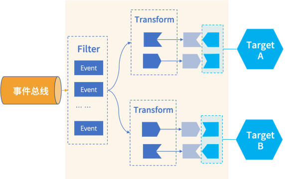

## Apache RocketMQ EventBridge 核心概念

理解EventBridge中的核心概念，能帮助我们更好的分析和使用EventBridge。本文重点介绍下EventBridge中包含的术语：

* EventSource：事件源。用于管理发送到EventBridge的事件，所有发送到EventBridge中的事件都必须标注事件源名称信息，对应CloudEvent事件体中的source字段。
* EventBus：事件总线。用于存储发送到EventBridge的事件。
* EventRule：事件规则。当消费者需要订阅事件时，可以通过规则配置过滤和转换信息，将事件推送到指定的目标端。
* FilterPattern：事件过滤模式，用于在规则中配置过滤出目标端需要的事件。
* Transform：事件转换，将事件格式转换成目标端需要的数据格式。
* EventTarget：事件目标端，即我们真正的事件消费者。

下面，我们具体展开：

### EventSource
事件源，代表事件发生的源头，用来描述一类事件，一般与微服务系统一一对应。比如：交易事件源、考勤事件源等等。事件源，是对事件一个大的分类，一个事件源下面，往往会包含多种事件类型(type)，比如交易事件源下面，可能包含：下单事件、支付事件、退货事件等等。

另外，需要值得注意的是，事件源并不用来描述发生事件的实体，取而代之的是，在CloudEvent中，我们一般选用subject来表示产生这个事件的实体资源。事件源有点像市场经济大卖场中的大类分区，例如：生鲜区、日化日用区、家用电器区等等。在事件中心这个"大卖场"，我们可以通过事件源快速的找到我们需要的事件。

### EventBus

事件总线是存储事件的地方，其下可以有多种实现，包括Local、RocketMQ、Kafka等。

事件生产者发送事件的时候，必须指定事件总线。事件总线是EventBridge的一等公民，其他所有资源都围绕事件总线形成逻辑上的隔离，即：事件源、事件规则必须都隶属于某一个事件总线下。不同事件总线下的事件源和事件规则可以重名，但是同一个事件总线下的事件源和规则必须不重名。

### EventRule

当消费者需要订阅事件时，可以通过事件规则配置过滤和转换信息，将事件推送到指定的目标端。所以，事件规则包含三部分：事件过滤+事件转换+事件目标。

### FilterPattern
通过事件过滤模式，我们可以对事件总线上的事件进行过滤，只将目标端需要的事件推送过去，以减少不必要的开通，同时减轻消费者
Target端的压力。目前EventBridge支持的事件过滤能力包括：
* 指定值匹配
* 前缀匹配
* 后缀匹配
* 除外匹配
* 数值匹配
* 数组匹配
* 以及复杂的组合逻辑匹配

（详细介绍待见其他文章）

### Transform
生产者的事件可能会同时被多个消费者订阅，但不同消费者需要的数据格式往往不同。这个时候，需要我们将生产者的事件，转换成消费者
Target端需要的事件格式。目前EventBridge支持的事件转换能力包括：
* 完整事件：不做转换，直接投递原生 CloudEvents；
* 部分事件：通过 JsonPath 语法从 CloudEvents 中提取出需要投递到事件目标的内容；
* 常量：事件只起到触发器的作用，投递内容为常量；
* 模板转换器：通过定义模板，灵活地渲染投递出去的事件格式；

（详细介绍待见其他文章）

### EventTarget

事件目标端，也即我们的事件消费者。在EventBridge架构中，消费者只需要按照自己的业务领域模型设计，提供一个公共的API（这个API既可用来接收事件，同时也用来前台管控面操作），EventBridge就会按照API定义需要的数据格式，将事件安全、可靠的推送给
Target消费者。
