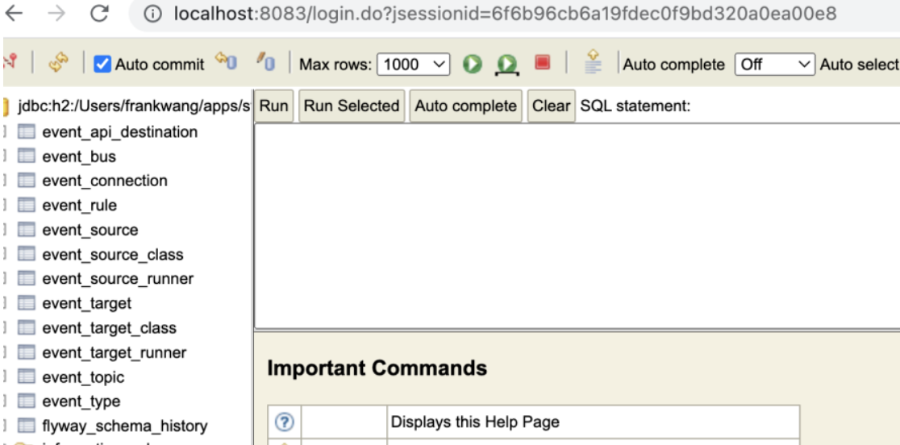

## Apache RocketMQ EventBridge 数据库依赖介绍与使用

RocketMQ EventBridge 使用数据库存储运行过程中定义的规则


数据库:
* 内置数据库h2，主要方便进行本地测试和快速开始
* mysql数据库，实际生产部署时可以使用

### 内置数据库H2
#### H2介绍
H2是一个使用Java实现的内存数据库，支持标准的SQL语法，支持大部分的MySQL语法和函数

```properties
# 是否开启本地页面访问
spring.profiles.active=local
```
本地运行后，访问h2数据库。访问url: localhost:8083，用户名/密码: sa/sa：



### mysql数据库
```properties
## database
spring.datasource.hikari.jdbc-url=jdbc:mysql://localhost:3306/eventBridge?useUnicode=true&characterEncoding=utf8&useSSL=false
spring.datasource.hikari.driver-class-name=com.mysql.jdbc.Driver
spring.datasource.hikari.username=xxxxx
spring.datasource.hikari.password=xxxxx
```