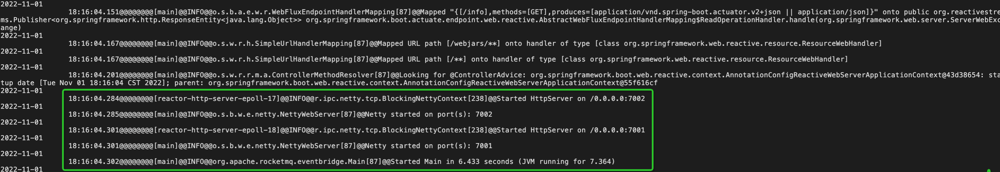

## Apache RocketMQ EventBridge 快速开始

RocketMQ EventBridge 需要一个消息服务来存储事件，另外需要一个Runtime来订阅并推送事件。这里我们选择 Apache RocketMQ 作为我们的消息服务，选择 Apache RocketMQ Connect 作为我们的Runtime来订阅和推送事件。当然，您也可以选择其他消息服务代替，EventBridge并不对此做限制。未来EventBridge也计划基于OpenMessaging Connect API 实现自己的Runtime，以便更好的提供事件驱动服务。


系统要求:
* 64位操作系统，推荐 Linux/Unix/macOS
* 64位 JDK 1.8+

### 部署Apache RocketMQ

Apache RocketMQ 是一个很棒的消息服务，我们默认选择它作为EventBus的默认存储。这里您可以根据这个手册快速部署: [Apache RocketMQ Quick Start](https://rocketmq.apache.org/docs/quick-start/)

### 部署Apache RocketMQ Connect

我们使用Apache RocketMQ Connect作为我们的默认Runtime，来连接外部的上下游服务，您可以根据手册完成部署: [RocketMQ Connect Quick Start](https://github.com/apache/rocketmq-connect) 。在部署 Apache RocketMQ Connect 之前，您应该下载下面的插件，并将其放在rocketmq-connect中配置参数“pluginPaths”所定义的目录下：


* [rocketmq-connect-eventbridge-jar-with-dependencies.jar](https://cn-hangzhou-eventbridge.oss-cn-hangzhou.aliyuncs.com/rocketmq-connect-eventbridge-0.0.1-SNAPSHOT-jar-with-dependencies.jar)
* [rocketmq-connect-dingtalk-jar-with-dependencies.jar](https://cn-hangzhou-eventbridge.oss-cn-hangzhou.aliyuncs.com/rocketmq-connect-dingtalk-1.0-SNAPSHOT-jar-with-dependencies.jar)
* [connect-cloudevent-transform-jar-with-dependencies.jar](https://cn-hangzhou-eventbridge.oss-cn-hangzhou.aliyuncs.com/connect-cloudevent-transform-1.0.0-SNAPSHOT-jar-with-dependencies.jar)
* [connect-filter-transform-jar-with-dependencies.jar](https://cn-hangzhou-eventbridge.oss-cn-hangzhou.aliyuncs.com/connect-filter-transform-1.0.0-SNAPSHOT-jar-with-dependencies.jar)
* [connect-eventbridge-transform-jar-with-dependencies.jar](https://cn-hangzhou-eventbridge.oss-cn-hangzhou.aliyuncs.com/connect-eventbridge-transform-1.0.0-SNAPSHOT-jar-with-dependencies.jar)

### 部署Apache RocketMQ EventBridge

* 获取 EventBridge

你可以从[这里]()下载EventBridge的二进制包：rocketmq-eventbridge-xxx-bin-release.zip,下载完毕后进行解压缩，你会得到一个如下目录：
```text
/rocketmq-eventbridge-xxx-bin-release/
|——bin
|   |——runserver.sh
|   |——eventbridge.sh
|——config
|   |——application.properties
|——jar
|   |——rocketmq-eventbridge.jar
```
  

* 配置 EventBridge

运行前，我们需要配置EventBridge的运行环境，修改config/application.properties,参考如下：

```properties
# Mysql数据库的连接地址
spring.datasource.url=jdbc:mysql://xxxx:3306/xxxx?characterEncoding=utf8
spring.datasource.username=xxx
spring.datasource.password=xxxx

# RocketMQ nameserver的连接地址
rocketmq.namesrvAddr=xxxxx:9876

# RocketMQ的集群名称.
rocketmq.cluster.name=DefaultCluster

# RocketMQ Connect的连接地址
rocketmq.connect.endpoint=xxxxxx:8082

# log默认配置
log.path=～
log.level=INFO
app.name=rocketmq-eventbridge
```

* 启动 EventBridge
```shell
sh bin/eventbridge.sh start 
```
log默认目录为～/rocketmq-eventbridge/rocketmq-eventbridge.log,可以修改上述log.path和app.name进行修改。可以通过日志来观察服务是否正常启动：


* 测试 EventBridge

当服务启动后，我们就可以通过下面的Demo用例来测试和验证EventBridge。
  
## Demo

####

* 创建事件总线

```text
POST /bus/createEventBus HTTP/1.1
Host: demo.eventbridge.com
Content-Type: application/json; charset=utf-8
{
"eventBusName":"demo-bus",
"description":"a demo bus."
}
```

* 创建事件源
```text
POST /source/createEventSource HTTP/1.1
Host: demo.eventbridge.com
Content-Type: application/json; charset=utf-8
{
"eventBusName":"demo-bus",
"eventSourceName":"demo-source",
"description":"A demo source."
}
```

* 创建事件规则

```text
POST /rule/createEventRule HTTP/1.1
Host: demo.eventbridge.com
Content-Type: application/json; charset=utf-8
{
  "eventBusName":"demo-bus",
  "eventRuleName":"demo-rule",
  "description":"A demo rule.",
  "filterPattern":"{}"
}
```

* 创建事件目标

创建一个投递到云上EventBridge的事件目标：

```text
POST /target/createEventTargets HTTP/1.1
Host: demo.eventbridge.com
Content-Type: application/json; charset=utf-8
{
    "eventBusName":"demo-bus",
    "eventRuleName":"demo-rule",
    "eventTargets":[
            {
            "eventTargetName":"eventbridge-target",
            "className":"acs.eventbridge",
                "config":{
                "RegionId":"cn-hangzhou",
                "AliyunEventBus":"rocketmq-eventbridge"
                }
            }
        ]
}
```

创建一个投递到钉钉机器人推送通知的事件目标：

```text
POST /target/createEventTargets HTTP/1.1
Host: demo.eventbridge.com
Content-Type: application/json; charset=utf-8
{
    "eventBusName":"demo-bus",
    "eventRuleName":"demo-rule",
    "eventTargets":[
        {
            "eventTargetName":"dingtalk-target",
            "className":"acs.dingtalk",
            "config":{
            "WebHook":"https://oapi.dingtalk.com/robot/send?access_token=b43a54b702314415c2acdae97eda1e092528b7a9dddb31510a5b4430be2ef867",
            "SecretKey":"SEC53483bf496b8f9e0b4ab0ab669d422208e6ccfaedfd5120ea6b8426b9ecd47aa",
            "Body":"{\"template\":\"{\\\"text\\\":{\\\"content\\\":\\\"${content}\\\"},\\\"msgtype\\\":\\\"text\\\"}\",\"form\":\"TEMPLATE\",\"value\":\"{\\\"content\\\":\\\"$.data.body\\\"}\"}"
            }
        }
    ]
}
```

* 发送事件到EventBus
  
  最后，我们通过API发送一条事件，并验证Target端是否按预期收到对应的事件。
```text
POST /putEvents HTTP/1.1
Host: demo.eventbridge.com
Content-Type:"application/cloudevents+json; charset=UTF-8"
{
  "specversion" : "1.0",
  "type" : "com.github.pull_request.opened",
  "source" : "https://github.com/cloudevents/spec/pull",
  "subject" : "123",
  "id" : "A234-1234-1234",
  "time" : "2018-04-05T17:31:00Z",
  "datacontenttype" : "application/json",
  "data" : {
    "body":"demo"
  },
  "aliyuneventbusname":"demo-bus"
}
```
