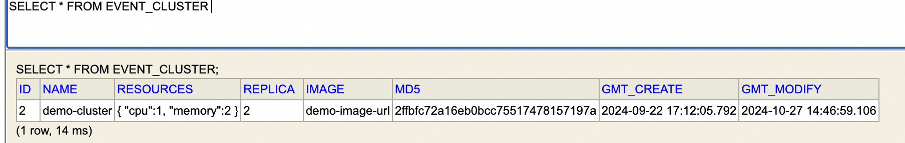
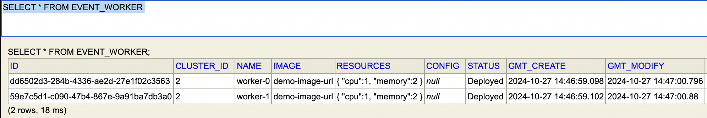

## Apache RocketMQ EventBridge Runtime 运行在 kubernetes

本文用来说明如何将EventBridge Runtime运行在kubernetes（以下简称K8S）.


前提准备:
* K8S环境
* K8S连接配置：kubeconfig
* Runtime 镜像

### 核心概念
#### Cluster
    
Cluster 是一个虚拟的概念，用来标注同一类Worker，这类Worker拥有相同的资源配置，镜像版本等。引入Cluster的目的主要包括：

- 资源隔离：不同的Cluster管理不同规模的Worker，同一个Target Runner只能分配到一个Cluster中的一个或多个Worker上；
- 方便Worker管理：Worker的生命周期管理，以Cluster为粒度，我们可以Cluster方便的升级该Cluster下所有的Worker；也可以通过Cluster来控制Worker的数量；

cluster定义在表 event_cluster：


#### Worker
Worker和Runtime的区别是：Runtime代表软件的运行时，而Worker是Runtime运行时的资源节点。Worker定义在表event_worker中：


### K8S集群信息
在application.properties中配置K8S集群信息：

```
kubernates.kube.config=xxxx/xxxx.config
```
### 初始化Cluster
在cluster中插入一条cluster的声明：
* name: 集群的名称
* resources: cpu核数为1，内存为1G；
* replica: 副本数
* image: 镜像地址
* md5: 用于标记当前集群的MD5值，判断集群配置是否有更新


系统会按照event_cluster表的声明，自动创建Worker资源。

### 检查Worker是否正常被创建
* 检查worker表元素是否被正常创建

* 检查K8S资源是否被正常创建
